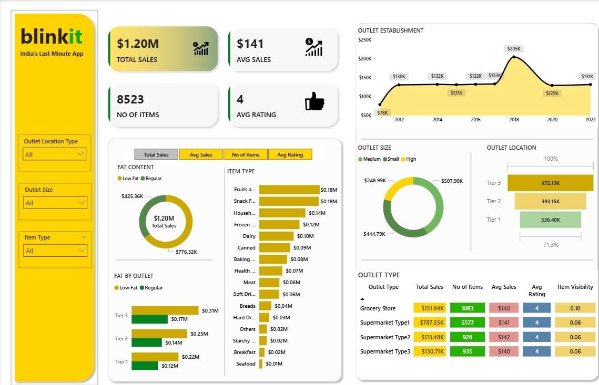

# 🛒 Blinkit Power BI Dashboard  

This repository contains an interactive **Power BI dashboard** built using Blinkit grocery data.  
It provides insights into sales performance, outlet analysis, and product category trends to support data-driven decision-making.

---

## 📊 Key Highlights  
- **Total Sales:** $1.20M | **Average Sales:** $141 | **No. of Items:** 8,523 | **Avg Rating:** 4 ⭐  
- **Outlet Analysis:** Performance by location (Tier 1, 2, 3), size (Small, Medium, High), and establishment year.  
- **Product Insights:** Sales contribution by item type and fat content (Regular vs. Low Fat).  
- **KPIs & Filters:** Interactive filters to analyze sales trends and outlet performance dynamically.  

---

## 🖼 Dashboard Preview  


---

## 🛠 Tools & Technologies  
- **Power BI** – Dashboard creation and interactive visualizations  
- **Excel** – Dataset preparation and cleaning  

---

## 🚀 How to Use  
1. Clone the repository:  
   ```bash
   git clone https://github.com/your-username/blinkit-powerbi-dashboard.git

